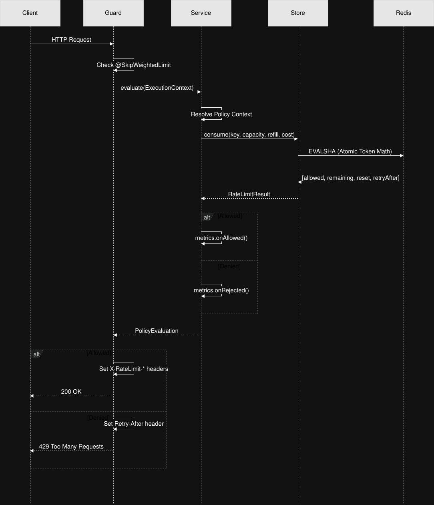

# Architecture Overview

The `nestjs-weighted-rate-limiter` is designed with strict separation of concerns, ensuring that HTTP plumbing, business logic evaluation, and state persistence remain decoupled. This allows for deep testability, high performance, and future extensibility.

## Core Components

The architecture consists of four primary layers.

### 1. HTTP Boundary (Guard & Decorators)

- **`@WeightedLimit()` / `@SkipWeightedLimit()`**. These decorators attach static or dynamic metadata to route handlers or controllers via the NestJS `Reflector`. They do not execute any logic themselves.
- **`WeightedRateLimiterGuard`**. This is a very thin wrapper implementing `CanActivate`. Its responsibilities are limited to checking skip flags, calling the service, and transforming the result into HTTP constructs (appending headers or throwing 429 exceptions).

### 2. Business Logic (Service Layer)

- **`WeightedRateLimiterService`**. The orchestrator of the rate-limiting domain. It resolves the `ContextResolver` functions attached via decorators, validates configuration, interacts with the abstract `IRateLimitStore`, triggers observability hooks, and implements Fail-Open recovery logic.

### 3. Persistence (Store Layer)

- **`IRateLimitStore`**. An abstraction over the token bucket persistence. By depending on this interface, the system can easily support in-memory stores for fast unit tests.
- **`RedisStore`**. The production implementation. It manages a persistent connection to Redis and is responsible for safely executing the Token Bucket algorithm.

### 4. Concurrency Control (Lua Script)

- **`token-bucket.lua.ts`**. To avoid race conditions under high concurrency, the token bucket math is executed entirely within a single atomic Lua script inside Redis. The script is pre-loaded using `EVALSHA` to keep network latency minimal.

## Component Interaction Flow

## Why ContextResolvers?

An important architectural choice was allowing `ContextResolver` (`(ctx: ExecutionContext) => T`) functions inside the `@WeightedLimit` decorator.

In complex B2B applications, rate limit policies are rarely static. By passing the `ExecutionContext` directly into the decorator's policy definitions, developers can dynamically resolve the bucket key, the burst capacity, or the cost of the request based on the current user's database tier, their JWT claims, or even the size of the request payload. This keeps controller logic clean and focused strictly on domain features.
